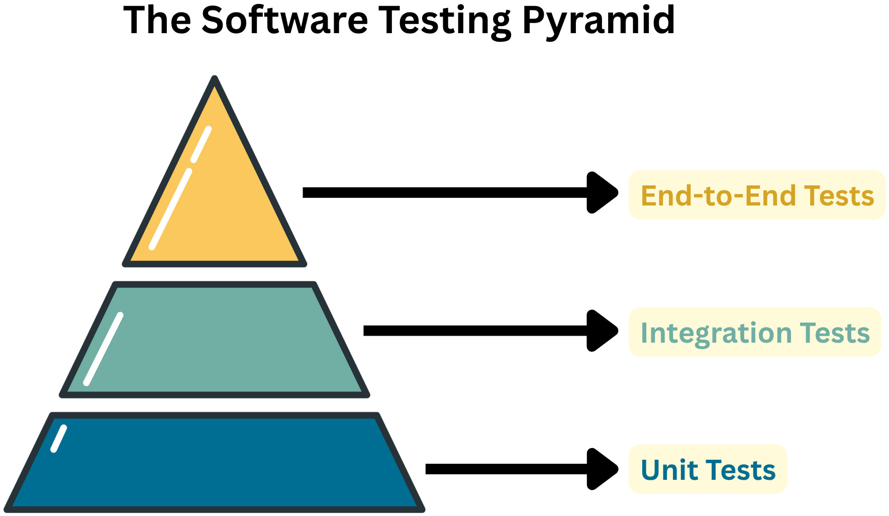

# TDD with LLMs

Created by [Clement Balea](https://miorey.github.io/)

---
layout: about-me

helloMsg: Hi!
name: Clement Balea
imageSrc: ./assets/me.png
position: left
job: Software Engineer
---

---
layout: two-cols
---

# Testing Pyramid


::right::

# Tools
 <br /> <br /> <br /> <br /> <br /> 
- **E2E:** Cypress · Playwright · Selenium <br /> <br />
- **Integration:** Postman with Newman<br /> <br />
- **Unit:** coverage · SonarQube

---
layout: section
---

# Code
<br />
```py
def plus(val_1: int, val_2: int) -> int:
    return val_1 + val_2
```

<br />
<br />

# Unit Test
<br />
```py
def test_plus():
    assert 3 == plus(1,2)
    assert -1 == plus(1,-2)
    assert -3 == plus(-1,-2)
```
 
---

# Example 1: generate tests and modify code

- Generate tests for a function with an LLM
- The test coverage shows the uncovered lines, ex for example:
```py
    elif last_name == "Summers":
        ret = "Buffy Summers" 
```
- Rewriting function without regressions, ex:
```py
def find_full_name_v1(last_name: str) -> str | None:
    return { "Bond": "James Bond", "Rosenberg": "Willow Rosenberg" }.get(last_name)
    
def find_full_name_v3(last_name: str) -> str:
    return find_full_name_v1(last_name) or (lambda: (_ for _ in ()).throw(ValueError("Full name not found")))()
```
- Coverage limitations
- 100% coverage is expensive and useless

---

# Example 2: Test driven development

- The main idea is to write the tests first
- Then ~~write~~ let the LLM write the code to make them pass
- Refactoring is easy because we have a clear picture of what we want to achieve
- But sometimes writing the tests takes more time than writing the code

---

# Example 3: Sometimes small clean tests creates complex and powerful code

- Transforming a text into leet text regardless the language:
ex: 
- "Hello world" -> "H3ll0 w0rld"
- "Tragi mâța de coadă" -> "7r4g1 m474 d3 c04d4"
- The LLM is able to improvise rules that you forgot
- But not always all of them ex: `â` => `4`

---

# Examples 4: more complex problems and thought steps

- If the LLM isn't able to find the code based on the tests, you might make a step test
- Generate code is not always optimised and can be a crap
- Cyclomatic complexity can help us to think when we should refactor:
`iris-vc-api` -> `test_utils.py` -> `test_find_founder_name`
- Today I use it in quite all my projects, and it accelerates and improve my code quality
`iris-fund` -> `test_admin_lib.py` -> `test_filename_to_document_info`

---

# Conclusion

- Test driven development can accelerate the development process
- You might wisely choose which of the test or the code you write first
- This guarantee a more robust and maintainable code
- You should always understand what you do, because LLM creates good code but also crapy code

---
